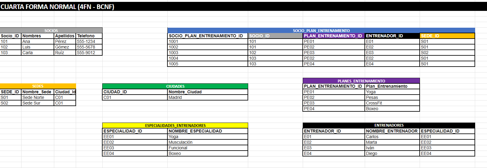
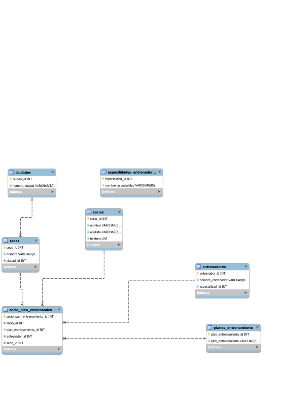

# Cuarta Forma Normal (4FN - BCNF)

## Temática

Sistema de gestión de socios, planes de entrenamiento, entrenadores y sedes de un centro gimnasio.

---

## Descripción

En este ejercicio se aplica la **Cuarta Forma Normal (4FN)** y se tiene en cuenta la **Forma Normal de Boyce-Codd (BCNF)** para organizar la información de un sistema deportivo.

El objetivo principal es reducir la redundancia de información y evitar problemas de actualización, inserción y eliminación, separando las entidades que representan conceptos diferentes y relacionándolas mediante claves primarias y foráneas.

La estructura final permite administrar:

- Socios.
- Sedes.
- Ciudades.
- Planes de entrenamiento.
- Entrenadores.
- Especialidades de los entrenadores.
- Relación entre socios, planes, entrenadores y sedes.

---

## Objetivo

Aplicar los principios de la **Cuarta Forma Normal (4FN)** para eliminar dependencias multivaluadas independientes y organizar correctamente las relaciones de la base de datos.

También se busca cumplir con los principios de **BCNF**, garantizando que los determinantes de las dependencias funcionales sean claves candidatas o superclaves.

---

# ¿Qué es la Cuarta Forma Normal?

La **Cuarta Forma Normal (4FN)** es una etapa de normalización que busca eliminar las **dependencias multivaluadas**.

Una tabla se encuentra en 4FN cuando:

1. Ya cumple con las formas normales anteriores.
2. No existen dependencias multivaluadas no triviales entre atributos que no deberían estar relacionados directamente.
3. Las relaciones independientes se encuentran separadas en tablas diferentes.

Una dependencia multivaluada ocurre cuando un atributo puede tener varios valores independientes respecto a otro atributo.

Por ejemplo, si un socio puede tener varios planes de entrenamiento y varios entrenadores de manera independiente, guardar toda esa información en una misma tabla puede generar combinaciones y duplicación innecesaria.

La solución consiste en separar las relaciones independientes.

---

# ¿Qué es BCNF?

La **Forma Normal de Boyce-Codd (BCNF)** es una versión más estricta de la Tercera Forma Normal.

Una relación cumple BCNF cuando, para cada dependencia funcional:

```text
X → Y
```
### Representacion de las tablas



### Diagrama Uml

¿Qué es un diagrama UML?

Un diagrama UML (Lenguaje Unificado de Modelado) es una representación gráfica que permite visualizar, diseñar y documentar la estructura y el funcionamiento de un sistema de software.

Se utiliza para mostrar elementos como:

Clases y sus atributos.
Relaciones entre clases.
Procesos y comportamientos del sistema.
Actores e interacciones.

En pocas palabras, UML sirve para representar visualmente cómo está organizado y cómo funciona un sistema antes o durante su desarrollo.
